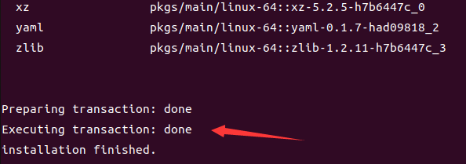

# 🛠 Install Miniconda/Anaconda

:warning:The insutructions below are more suitable for Chinese. If you are not, you may find proper tutorial in [the references](install-miniconda-anaconda.md#references).

## Insutructions

1.  To download the installer, open a terminal and use the following command, depending on your Linux architecture:

    ```bash
    wget https://repo.continuum.io/miniconda/Miniconda3-latest-Linux-x86_64.sh
    ```
2.  To install, run the following command


    ```bash
    bash Miniconda3-latest-Linux-x86_64.sh
    ```
3. Press Enter to review the license agreement. Then press and hold Enter to scroll.
4. Enter `yes` to agree to the license agreement.
5.  Use Enter to accept the default install location. If you accept the default install location, the Miniconda will be installed in `/home/<USER>/miniconda3`. The following figure shows the successful installation.

    <figure><figcaption><p>successful installation</p></figcaption></figure>

    _**NOTE**: Miniconda recommends you accept the default install location. Do not choose the path as `/usr` for the Anaconda/Miniconda installation._
6.  After installation, entering “yes” to initialize Miniconda Distribution.

    If you enter “no”, then conda will not modify your shell scripts at all. In order to initialize conda after the installation process is done, run the following commands:

    ```bash
    # Replace <PATH_TO_CONDA> with the path to your conda install
    source <PATH_TO_CONDA>/bin/activate
    conda init
    ```

    <figure><figcaption><p>successfully initialized</p></figcaption></figure>
7. Close and re-open your terminal window for the installation to take effect, or enter the command `source ~/.bashrc` to refresh the terminal.
8.  You can also control whether or not your shell has the base environment activated each time it opens.

    ```bash
    # The base environment is activated by default
    conda config --set auto_activate_base True

    # The base environment is not activated by default
    conda config --set auto_activate_base False

    # The above commands only work if conda init has been run first
    # conda init is available in conda versions 4.6.12 and later
    ```
9. verify your installation by using `conda -V` and the corresponding version of miniconda will be returned if successfully installed.

## Additions

1. To create a new environment by conda, using `conda create -n <your environment name> [python=<version>]` and use `conda activate <your environment name>` to activate.
2. use `conda deactivate <your environment name>` to deactivate and use `conda remove -n <your environment name> --all` to delete

## References

* Miniconda
  * In Chinese: [Linux系统miniconda安装流程](https://zhuanlan.zhihu.com/p/541309324)
  * In English: [Install Miniconda on Linux from the command line in 5 steps](https://javedhassans.medium.com/install-miniconda-on-linux-from-the-command-line-in-5-steps-403912b3f378)
* Anaconda
  * In Chinese: [如何在Linux服务器上安装Anaconda（超详细） 原创](https://blog.csdn.net/wyf2017/article/details/118676765)
  * In Ehglish: [Installing on Linux — Anaconda documentation](https://docs.anaconda.com/free/anaconda/install/linux.html)
