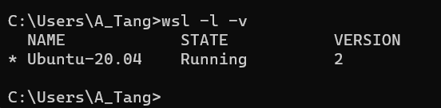
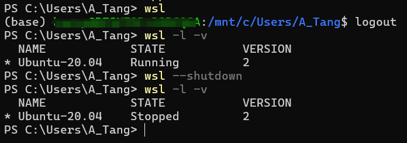
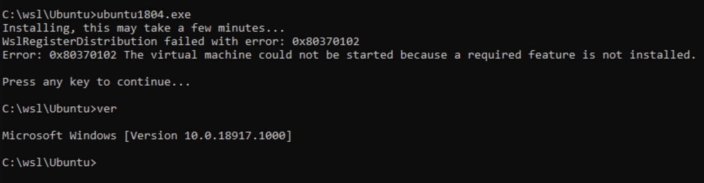

# 🛠 Install a Ubuntu Distribution through WSL2

:star\_struck:In this note, we are going to learn how to install WSL2. If you want to learn about the differences between WSL2 and WSL1, please refer to [this official docs](https://learn.microsoft.com/zh-cn/windows/wsl/compare-versions?source=recommendations). For more information, please refer to [references](install-a-ubuntu-distribution-through-wsl2.md#references).

## Instructions

### Installation

1.  use `wsl --list --online` to view available Linux distributions that can be downloaded through the online store

    <figure><figcaption></figcaption></figure>
2.  use `wsl --install -d <distribution name>` to install the certain distribution and this well a few minutes for the first time. For example, in this note, Harry installed Ubuntu-20.04, for which he used `wsl --install -d Ubuntu-20.04`. If you counter some errors, please refer to [Additions](install-a-ubuntu-distribution-through-wsl2.md#additions)

    <figure><figcaption>
Successful installation
</figcaption></figure>

### Verification

1.  use `wsl -l -v` to view the installed distributions' name, state and version.

    <figure><figcaption></figcaption></figure>
2. Once installed, there are several ways to run a Linux distribution. Here are some recommend ways:
   1.  Typing the name of the installed distribution in the _Windows Start menu_. For example, "Ubuntu".  This opens Ubuntu in its own console window.

       <figure><figcaption>
search "Ubuntu" in the Windows Start menu
</figcaption></figure>
   2.  Typing the name of the installed distribution in _cmd_ or _Windows Powershell_. Type `wsl` or `wsl.exe` will open the default distribution. To change default setting, refer to [this](https://learn.microsoft.com/zh-cn/windows/wsl/install#check-which-version-of-wsl-you-are-running).

       _**NOTE**: If you have installed visual studio code, you can type `code .` in the cli of Ubuntu to connect Linux server with VS Code server._

       <figure><figcaption>
connect VSC with linux server
</figcaption></figure>
   3. For more information, refer to [this](https://learn.microsoft.com/zh-cn/windows/wsl/install#ways-to-run-multiple-linux-distributions-with-wsl).

## Additions

1.  If you counter error 0x800701bc, the tutorials below are recommended for your&#x20;

    <figure><figcaption>
Error: 0x800701bc
</figcaption></figure>

    1. In Chinese: [win10 WSL2问题解决WslRegisterDistribution failed with error: 0x800701bc](https://blog.csdn.net/qq\_18625805/article/details/109732122)
    2. In English: [\[Solved\] WslRegisterDistribution Failed with Error: 0x800701bc](https://www.partitionwizard.com/partitionmagic/wslregisterdistribution-failed-with-error-0x800701bc.html)
2.  If you counter error 0x80370102, the tutorials below are recommended for your&#x20;

    <figure><figcaption>
Error: 0x80370102
</figcaption></figure>

    1. In Chinese: [wsl2的Error 0x80370102 解决方案](https://zhuanlan.zhihu.com/p/147233604)
    2. In English: [Fix: WSL Register Distribution Error 0x80370102 Windows ...](https://www.partitionwizard.com/partitionmagic/wslregisterdistribution-failed-with-error-0x80370102.html)

## References

* In Chinese: [如何使用 WSL 在 Windows 上安装 Linux | Microsoft Learn](https://learn.microsoft.com/zh-cn/windows/wsl/install)
* In English: [How to install Linux on Windows with WSL | Microsoft Learn](https://learn.microsoft.com/en-gb/windows/wsl/install)
