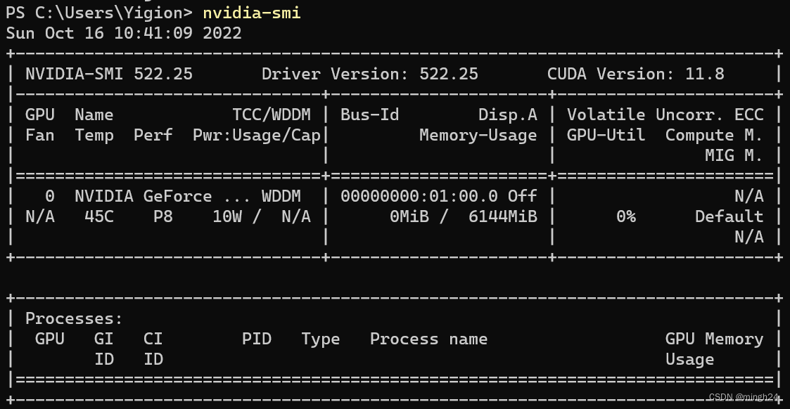

# 🛤️ Install Pytorch on a GPU Server

## Instructions

### Install CUDA

#### First

In Winows cmd, use `nvidia-smi` to check the version of NVIDIA drive. For example, in the figure below, the version is 522.25

<figure><figcaption></figcaption></figure>

If you haven't installed a NVIDIA driver on Windows, go to [NVIDIA Driver Downloads page](https://www.nvidia.cn/Download/index.aspx) to search, download and install the lastest version of NVIDIA driver that you can install for Winows due to your hardware and software conditions.&#x20;

<figure><figcaption></figcaption></figure>

After installation, excute `nvidia-smi` again to check.

#### Second

_**Note**: the new Windows NVIDIA drivers have built-in support for WSL 2, which means that you only need to have the NVIDIA drivers in Windows, not in WSL 2. You only need to install the CUDA Toolkit for WSL 2._

In the figure above, we konw that the latest version of CUDA driver that the NVIDIA driver support is 11.8 from the return of `nvidia-smi`. In this note, I download CUDA 11.3.0 for WSL-Ubuntu.

1.  **Find Correct Version**: To install CUDA driver for WSL-Ubuntu, go to [CUDA Toolkit Archive](https://developer.nvidia.com/cuda-toolkit-archive) page, choose your target CUDA driver and follow the official instructions. For information about debugging, go to [_Additions_](install-pytorch-on-a-gpu-server.md#additions).

    <figure><figcaption><p>CUDA download steps</p></figcaption></figure>
2.  **Install**: If you use runfile (local) to install CUDA, enter `accept` for user license agreement and customize installation components (CUDA Samples, Demo Suite and Documentation are not needed). After customization, enter `install` and it will start to install.

    <figure><figcaption><p>CUDA user license agreement</p></figcaption></figure>

    <figure><figcaption><p>customize installation components</p></figcaption></figure>

    <figure><figcaption><p>Successful installation</p></figcaption></figure>
3.  **Configure Environment Variables**: enter `sudo vim ~/.bashrc` and append the following code to the end:

    ```bash
    export PATH=/usr/local/cuda-11.3/bin${PATH:+:${PATH}}
    export LD_LIBRARY_PATH=/usr/local/cuda-11.3/lib64${LD_LIBRARY_PATH:+:${LD_LIBRARY_PATH}}
    ```


    Then, if nothing goes wrong, enter `nvcc -V` and you can view the version of CUDA driver on WSL-Ubuntu (11.3), which is different from the version on my host Windows (11.8)

    <figure><figcaption><p>nvcc --version</p></figcaption></figure>

### Install Pytorch

Go to [Previous Pytorch Version](https://pytorch.org/get-started/previous-versions/) page to get official instructions to download and install torch, which is corresponding to your CUDA driver and system.

In this case, I use:

```bash
pip install torch==1.10.1+cu113 torchvision==0.11.2+cu113 torchaudio==0.10.1 -f https://download.pytorch.org/whl/cu113/torch_stable.html
```

where `1.10.1` refers to the version of torch and `cu113` refers to the **lowest** version of CUDA that the torch supports.

After installation, use the following code to check whether pytorch is available on your GPU server:

```python
import torch
print(torch.cuda.is_available())
```

The return `True` is expected. If `False` is returned, check your installation steps!

## Additions

```python
import torch
print(torch.__version__)  # view torch version
print(torch.cuda.is_available()) # view whether CUDA is available
print(torch.cuda.device_count()) # view number of available GPU
print(torch.version.cuda) # view CUDA version
```

## Additions

### ERROR: Missing gcc. gcc is required to continue.

When install CUDA following official instructions with runfile (local), the following error may occur:

```
Failed to verify gcc version. See log at /var/log/cuda-installer.log for details.
```

In `/var/log/cuda-installer.log`, you may see `[error] Missing gcc. gcc is required to continue`. Follow the code below and you can solve it:

```bash
sudo apt update
sudo apt install build-essential
```

use `gcc --version` to verify whether gcc has been successfully install. The default version of GCC available in the Ubuntu 20.04 is 9.3.0:&#x20;

```
gcc (Ubuntu 9.3.0-10ubuntu2) 9.3.0
Copyright (C) 2019 Free Software Foundation, Inc.
This is free software; see the source for copying conditions.  There is NO
warranty; not even for MERCHANTABILITY or FITNESS FOR A PARTICULAR PURPOSE.
```

## References

1. [WSL安装Ubuntu及配置Pytorch](https://blog.csdn.net/LeMonMannnn/article/details/130987243)
2. [WSL 2 Ubuntu 20.04 配置CUDA 原创](https://blog.csdn.net/Yiang0/article/details/127349203)
3. [以Runfile的方式安装CUDA 11](https://yinguobing.com/install-cuda11-with-runfile/)
